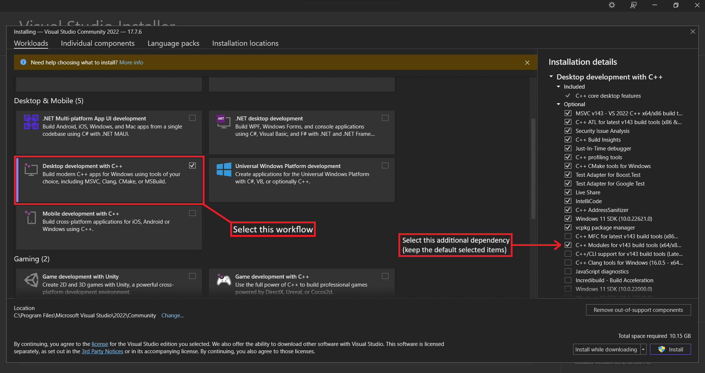

# Windows

```admonish warning
🚧 Page Is Incomplete! 🏗️
```

Windows has many different compilers at its disposal. Some offer native support to building against the Windows runtime while others will emulate a UNIX (the predecessor to Linux and BSD) environment to aid in porting software built for UNIX-like systems. As the specifics can get confusing, this book will only cover the installation of Window's native compiler toolchain MSVC.

## MSVC Installation

The Microsoft Visual C++ (MSVC) compiler is Microsoft's official toolchain for building software natively on Windows. It is installed with the Visual Studio Integrated Developer Environment (IDE). MSVC (and the whole Visual Studio suite) can be obtained from Microsoft's [official download page](https://visualstudio.microsoft.com/vs/). Make sure to select the correct edition (community being the free version) and click 'Download'. This will download the setup program `VisualStudioSetup.exe`, which is used to install and configure Visual Studio Installer (VSI). The VSI allows you to select which tools and technologies from the Visual Studio suite you want to install. Once you have installed the VSI, start the program and you should be presented with some default tool configurations (workflows). For developing with C++ you will need to select the 'Desktop development with C++' workflow. You will also want to tick a few optional features as well (found in the side bar).



Finally, click the 'Install' button in the bottom right of the window to start the installation.

> [Microsoft's official installation instructions for C++](https://learn.microsoft.com/en-us/cpp/build/vscpp-step-0-installation?view=msvc-170)

## Verifying MSVC Installation

To verify you installed Visual Studio correctly you can open the newly installed 'Developer Command Prompt for VS'. This prompt is needed in order to load the MSVC tooling into the prompt as it is not including by default in CMD or PowerShell. Simply run the following command to verify the install of the compiler.

```console
> cl
Microsoft (R) C/C++ Optimizing Compiler Version 19.37.32822 for x86
Copyright (C) Microsoft Corporation.  All rights reserved.

usage: cl [ option... ] filename... [ /link linkoption... ]
```

> Notes:
>
> - Alternatively you can follow [Microsoft's tutorial](https://learn.microsoft.com/en-us/cpp/build/vscpp-step-1-create?view=msvc-170) for creating a new C++ VS Project. This will be more convenient than opening a 'Developer Command Prompt' every time you want to compile a program and having to run the `cl` command manually but it takes more work setting compiler flags etc. for simple projects.
> - Throughout this book, any commands will assume the GCC CLI flags and names. You will need to look up the equivalent flags for MSVC.

## Installing Git

We will also need to install Git in order to install a particular package later. Git can be installed by going to the ['Git for Windows' installation](https://git-scm.com/download/win) page and selecting the correct version (eg. x64 for 64-bit systems) and following the installation Wizard. Be sure to select the option for adding Git to the `PATH`.

## Installing CMake

CMake is a build tool for C++ projects. It is used to manage different configurations for a projects. You can download the latest release from [CMake's Release Page](https://cmake.org/download/#latest:~:text=Files-,Windows%20x64%20Installer%3A,-cmake%2D3.27.8%2Dwindows) (scroll down to 'Latest Release' not 'Release Candidate'). You can verify it was installed correctly by opening CMD and running.

```console
> cmake --version
cmake version 3.25.1

CMake suite maintained and supported by Kitware (kitware.com/cmake).
```

## Installing `vcpkg`

We will also need some way to install external libraries. While many different tools exist the tool `vcpkg` was chosen for this book. `vcpkg` is an open source tool developed by Microsoft used for downloading and managing C++ libraries with CMake. We can install, add it to your `PATH` and validate the install using the following batch/CMD commands:

```console
> cd %userprofile%
> mkdir bin
> cd bin
> git clone https://github.com/Microsoft/vcpkg.git
> .\vcpkg\bootstrap-vcpkg.bat -disableMetrics
> setx VCPKG_ROOT %userprofile%\bin\vcpkg
> setx PATH "%PATH%;%userprofile%\bin\vcpkg"
:: You must now reload CMD for the Environment Variables to refresh by closing and reopening the CMD.

> vcpkg --version
vcpkg package management program version 2023-10-18-27de5b69dac4b6fe8259d283cd4011e6d20a84ce

See LICENSE.txt for license information.
```

```admonish note
Any details displayed from verifying a given newly installed tool may differ to what is displayed in this book.
```

<!-- Add links to MinGW, Cygwin, Msys2, MinGW-x64 etc.? -->
